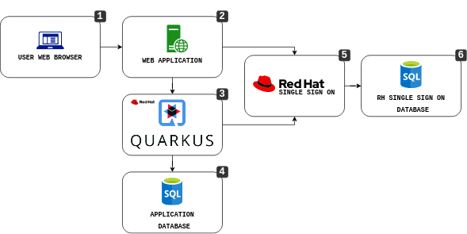
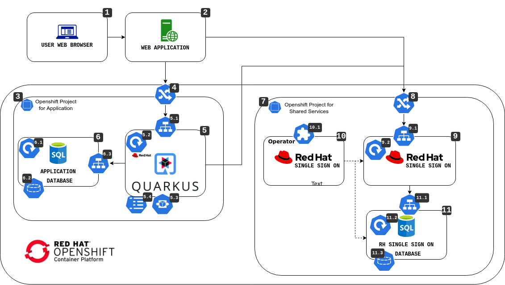
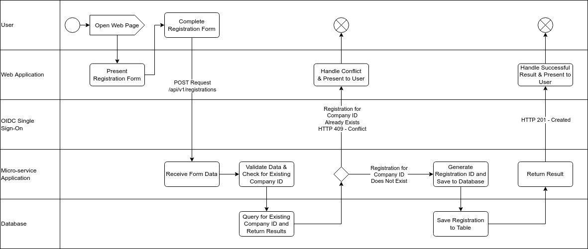
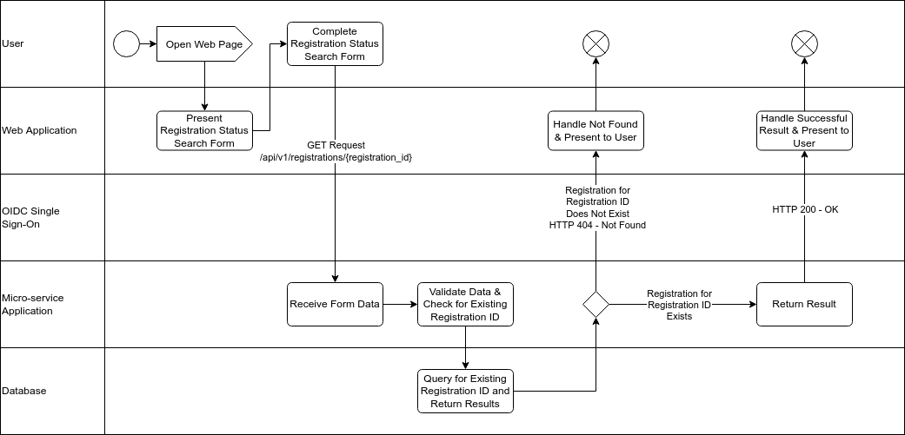
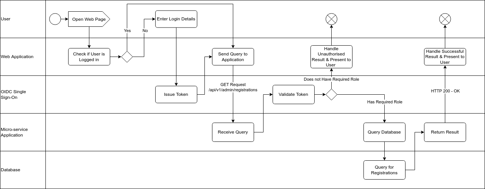
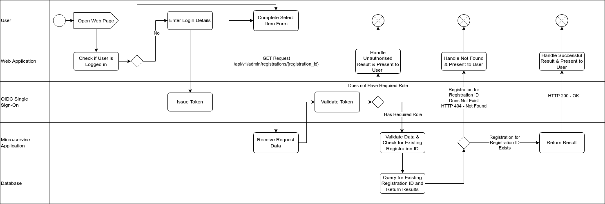
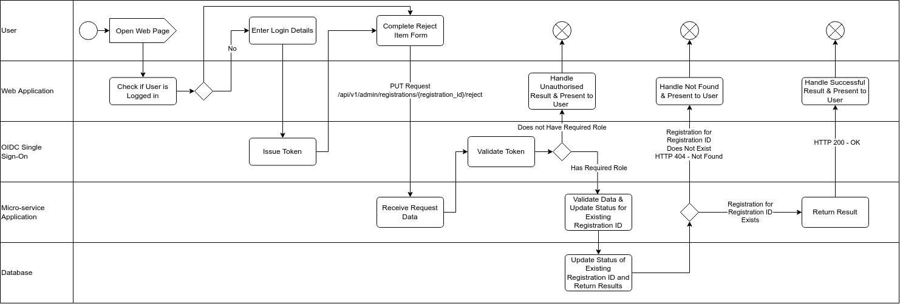
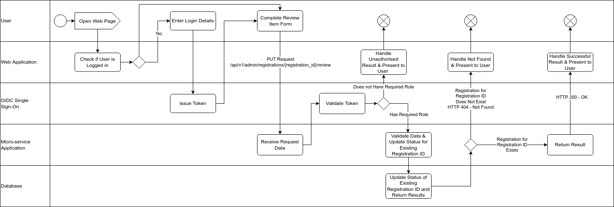
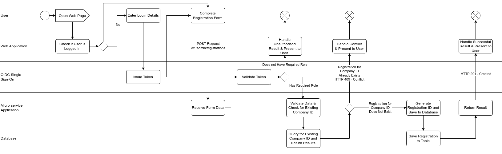

# Service to Service Authentication Demonstration and Testing Project

This project uses Quarkus, the Supersonic Subatomic Java Framework.

If you want to learn more about Quarkus, please visit its website: https://quarkus.io/ .

- [Service to Service Authentication Demonstration and Testing Project](#rest-api-with-crud-project)
    - [Initial setup of the development environment](#initial-setup-of-the-development-environment)
        - [Installation Guides](#installation-guides)
    - [Setup of the Red Hat build of Quarkus](#setup-of-the-red-hat-build-of-quarkus)
        - [Initializing a new Quarkus Project](#initializing-a-new-quarkus-project)
    - [Application Design and Architecture](#application-design-and-architecture)
        - [Purpose](#purpose)
        - [Services](#services)
            - [Openshift](#openshift)
        - [Flows](#flows)
            - [New Registration Flow](#new-registration-flow)
            - [Registration Status Query Flow](#registration-status-query-flow)
            - [Registration List Flow](#registration-list-flow)
            - [Registration Get Flow](#registration-get-flow)
            - [Registration Reject Flow](#registration-reject-flow)
            - [Registration Review Flow](#registration-review-flow)
            - [Registration Approve Flow](#registration-approve-flow)
            - [New GovtUser Registration Flow](#new-govtuser-registration-flow)
        - [Application Components](#application-components)
    - [Running the Application](#running-the-application)
        - [Running the Application in Dev Mode](#running-the-application-in-dev-mode)
        - [Packaging and Running the Application](#packaging-and-running-the-application)
        - [Creating a Native Executable](#creating-a-native-executable)
    - [Containerizing the Application](#containerizing-the-application)
        - [Creating an Image with the Application](#creating-an-image-with-the-application)
            - [Issue the following command to view any images on the current host](#issue-the-following-command-to-view-any-images-on-the-current-host)
            - [Issue the following command to tag an image](#issue-the-following-command-to-tag-an-image)
            - [Issue the following command to log in to a repository](#issue-the-following-command-to-log-in-to-a-repository)
            - [Issue the following command to push an image based on the tag](#issue-the-following-command-to-push-an-image-based-on-the-tag)
    - [Deploying the Application and Dependencies to Openshift](#deploying-the-application-and-dependencies-to-openshift)
        - [Required Steps](#required-steps)
            - [Example ConfigMap](#example-configmap)
            - [Example Application Service](#example-application-service)
            - [Example Application Route](#example-application-route)
            - [Example Application Deployment](#example-application-deployment)
        - [Optional Steps](#optional-steps)
            - [Application Database](#application-database)
                - [Example Database PVC](#example-database-pvc)
                - [Example Database Deployment](#example-database-deployment)
                - [Example Database Service](#example-database-service)
            - [OpenID Single Sign On Provider](#openid-single-sign-on-provider)
                - [Example Operator Group](#example-operator-group)
                - [Example Subscription](#example-subscription)
                - [Example Keycloak](#example-keycloak)
                - [Example KeycloakRealm](#example-keycloakrealm)
                - [Example KeycloakClient](#example-keycloakclient)
                - [Example KeycloakUser with GovtUser Role](#example-keycloakuser-with-govtuser-role)
                - [Example KeycloakUser with RmUser Role](#example-keycloakuser-with-rmuser-role)

## Initial setup of the development environment

The following tools will be used for development of this application for deployment into an Openshift environments and need to be installed and configured on developer machines:

- Java 11 for application development
- Red Hat CodeReady Studio IDE
- Docker
- Git client

### Installation Guides

- [Installing Red Hat OpenJDK 1.11 on Linux](./docs/openjdk-1.11.linux.md)
- [Installing Red Hat OpenJDK 1.11 on Windows](./docs/openjdk-1.11.windows.md)
- [Installing Docker on Windows](https://docs.docker.com/desktop/windows/install/)
- [Installing Git on Windows](https://docs.docker.com/desktop/windows/install/)

## Setup of the Red Hat build of Quarkus

Quarkus 2.2 introduces an extension registry that hosts Quarkus extensions provided by Red Hat. You can configure your Quarkus developer tools to access extensions in this registry by adding the registry to your registry client configuration file (for example, C:\users\username\.quarkus\config.yaml):

```
registries:
  - registry.quarkus.redhat.com
  - registry.quarkus.io
```

### Initializing a new Quarkus Project

This section is informational for beginning a new Quarkus project that is not based on existing code. These steps are not required for using this project.

The most straightforward way of initializing a new quarkus project is to use the **quarkus-maven-plugin** and answering the prompts accordingly. Alternatively there is a web-based interface that can be used to achieve this here: https://code.quarkus.redhat.com/.  More information about using this plugin can be found here: https://quarkus.io/guides/maven-tooling

This project was created running the following command:

```
mvn -P redhat com.redhat.quarkus.platform:quarkus-maven-plugin:2.2.3.Final-redhat-00013:create
-Dextensions="quarkus-resteasy-reactive,quarkus-resteasy-reactive-jackson,quarkus-smallrye-health,quarkus-micrometer,quarkus-micrometer-registry-prometheus,oidc,quarkus-smallrye-openapi,quarkus-hibernate-validator,quarkus-hibernate-envers,quarkus-flyway,quarkus-jdbc-postgresql,quarkus-hibernate-orm-panache"
```

This will pull in various dependencies that provide functionality for the application, including a reactive REST framework, an ORM to interact with databases, OpenAPI documentation and monitoring capabilities that are used to perform health checks and metric gathering.

```
[INFO] Scanning for projects...
[INFO]
[INFO] ------------------< org.apache.maven:standalone-pom >-------------------
[INFO] Building Maven Stub Project (No POM) 1
[INFO] --------------------------------[ pom ]---------------------------------
[INFO]
[INFO] --- quarkus-maven-plugin:2.2.3.Final-redhat-00013:create (default-cli) @ standalone-pom ---
[INFO] Looking for the newly published extensions in registry.quarkus.redhat.com
[INFO] Looking for the newly published extensions in registry.quarkus.io
Set the project groupId: com.riyadbank
Set the project artifactId: rest-crud
Set the project version: 1.0.0-SNAPSHOT
Would you like some code to start (yes), or just an empty Quarkus project (no): yes
```

Answering the prompted questions will set the groupId, artifactId and version in the pom file.

## Application Design and Architecture

### Purpose

This application has been designed to fulfil the following requirements:

- Provide CRUD (create, read, update, delete) interactions with a database
    - For this example an RDBMS is used and this instance ships with Postgresql JDBC drivers which can be seamlessly replaced by any other supported JDBC driver such as Oracle.
- Expose a REST API to allow interaction with the data
- Secure interactions through the REST API by using RBAC to protect various functions

Furthermore, the application provides features which are considered best practices for containerized applications:

- Provide monitoring end-points (liveness and readiness probes)
- Provide metrics recording and gathering capabilities
- Provide REST API documentation in the form of OpenAPI specifications

### Services

The application has been designed to operate both on bare-metal or virtual machine environment or deployed to Openshift. The following services are the base services as would be required for deployment in a bare-metal or virtual machine environment:



1. User system with a Web Browser communicates with Web Application
2. Web Application server hosting a Web Application which communicates directly with the application and, for protected resources, communicates with an OIDC provider to authenticate the user and collect an access token
3. The application which exposes a REST API for inbound connections, communicates with a SQL database used to store application data and communicates with the OIDC provider to validate tokens
4. The application Database used to store data. This database should be a RDBMS such as Postgresql or Oracle.
5. The OIDC provider used to authenticate and authorize access to protected resources. In this case Red Hat Single Sign On has been used.
6. The OIDC provider database used to store the OIDC system data

#### Openshift

The application has been designed to be deployed to an Openshift cluster. In order to deploy several resources will need to be managed and maintained on the Openshift cluster to provide dependency services and expose the application to clients outside of the cluster.



1. User system with a Web Browser communicates with Web Application
2. Web Application server hosting a Web Application which communicates directly with the application and, for protected resources, communicates with an OIDC provider to authenticate the user and collect an access token
3. An Openshift project (namespace) in which the application and related services used exclusively by the application are deployed
4. An Openshift route that exposes the linked application service (5.1) to clients external to the Openshift cluster
5. The Application
    1. An Openshift service serves as an internal load balancer to the application pod/s. It identifies a set of replicated pods in order to proxy the connections it receives to them. Backing pods can be added to or removed from a service arbitrarily while the service remains consistently available, enabling anything that depends on the service to refer to it at a consistent address
    2. Application deployment which provides declarative updates for Pods and ReplicaSets
    3. A HorizontalPodAutoscaler automatically updates a workload resource (such as a Deployment or StatefulSet), with the aim of automatically scaling the workload to match demand
    4. A ConfigMap is an API object used to store non-confidential data in key-value pairs. Pods can consume ConfigMaps as environment variables, command-line arguments, or as configuration files in a volume. A ConfigMap allows you to decouple environment-specific configuration from your container images, so that your applications are easily portable. The application ConfigMap contains application configuration which enables external configuration of the application removing the need to recompile source code or rebuild images for specific environments
6. The application database. This can be deployed off of cluster if required
    1. Database deployment which provides declarative updates for Pods and ReplicaSets
    2. Database PersistentVolumeClaim (PVC) is a request for storage by a user. It is similar to a Pod. Pods consume node resources and PVCs consume PV resources. Pods can request specific levels of resources (CPU and Memory). Claims can request specific size and access modes (e.g., they can be mounted ReadWriteOnce, ReadOnlyMany or ReadWriteMany)
    3. An Openshift service serves as an internal load balancer to the database pod/s
7. An Openshift project (namespace) in which shared services, services used by many applications, are deployed
8. 4. An Openshift route that exposes the linked RH SSO service (9.1) to clients external to the Openshift cluster
9. Red Hat SSO - a Single Sign On Provider managed by the RH SSO operator (10)
    1. An Openshift service serves as an internal load balancer to the RH SSO pod/s
    2. RH SSO deployment which provides declarative updates for Pods and ReplicaSets
10. The Red Hat SSO Operator, an operator is an application-specific controller that can help you package, deploy, and manage a Kubernetes application
    1. RH SSO Custom Resource Definitions (CRD) that are used by the operator to manage the RH SSO instance
11. The RH SSO database managed by the RH SSO operator (10)
    1. An Openshift service serves as an internal load balancer to the RH SSO database pod/s
    2. RH SSO database deployment which provides declarative updates for Pods and ReplicaSets
    3. RH SSO  Database PersistentVolumeClaim

### Flows

#### New Registration Flow


#### Registration Status Query Flow


#### Registration List Flow

> **_NOTE:_** This flow requires that the user is in one of the required roles to perform the request



#### Registration Get Flow

> **_NOTE:_** This flow requires that the user is in one of the required roles to perform the request



#### Registration Reject Flow

> **_NOTE:_** This flow requires that the user is in one of the required roles to perform the request



#### Registration Review Flow

> **_NOTE:_** This flow requires that the user is in the RmUser role to perform the request



#### Registration Approve Flow

> **_NOTE:_** This flow requires that the user is in the GovtUser role to perform the request


#### New GovtUser Registration Flow

> **_NOTE:_** This flow requires that the user is in the GovtUser role to perform the request. The Registration is automatically marked as Approved.




### Application Components

The following components were included in order to provide these functions:

|Component|Category|Description|Guide Link|
|---|---|---|---|
|quarkus-resteasy-reactive|Web|RESTEasy Reactive is a new JAX-RS implementation written from the ground up to work on our common Vert.x layer and is thus fully reactive, while also being very tightly integrated with Quarkus and consequently moving a lot of work to build time.|https://quarkus.io/guides/resteasy-reactive|
|quarkus-resteasy-reactive-jackson|Web|Provides (de)serialization of JSON Objects|https://quarkus.io/guides/resteasy-reactive#json-serialisation|
|quarkus-smallrye-openapi|Web|Used to expose its API description through an OpenAPI specification|https://quarkus.io/guides/openapi-swaggerui|
|oidc|Security|Uses OpenID Connect (OIDC) Extension to protect your JAX-RS applications using Bearer Token Authorization where Bearer Tokens are issued by OpenId Connect and OAuth 2.0 compliant Authorization Servers|https://quarkus.io/guides/security-openid-connect|
|quarkus-hibernate-orm-panache|Data|Provides an Object Relational Mapper to interact with underlying data stores|https://quarkus.io/guides/hibernate-orm-panache|
|quarkus-jdbc-postgresql|Data|Provides the Postgresql DB JDBC driver extension|https://quarkus.io/guides/hibernate-orm#setting-up-and-configuring-hibernate-orm|
|quarkus-hibernate-validator|Data|Provides Hibernate Validator/Bean Validation for validating the input/output of your REST services and validating the parameters and return values of the methods of your business services|https://quarkus.io/guides/validation|
|quarkus-hibernate-envers|Data|Provide an easy auditing / versioning solution for entity classes|https://quarkus.io/guides/hibernate-orm#envers|
|quarkus-flyway|Data|Provides database migrations|https://quarkus.io/guides/flyway|
|quarkus-smallrye-health|Observability|SmallRye Health allows applications to provide information about their state to external viewers which is typically useful in cloud environments where automated processes must be able to determine whether the application should be discarded or restarted.|https://quarkus.io/guides/smallrye-health|
|quarkus-micrometer|Observability|Provides the Micrometer metrics library for runtime and application metrics|https://quarkus.io/guides/micrometer|
|quarkus-micrometer-registry-prometheus|Observability|Provides the Prometheus registry for metrics gathering. Prometheus is the default metrics registry implementation used by Red Hat Openshift||

## Running the Application

### Running the Application in Dev Mode

You can run your application in dev mode that enables live coding using:
```shell script
mvnw compile quarkus:dev
```

> **_NOTE:_**  Quarkus now ships with a Dev UI, which is available in dev mode only at http://localhost:8080/q/dev/. For more information please refer to https://quarkus.io/guides/dev-ui.

### Packaging and Running the Application

The application can be packaged using:
```shell script
mvnw package
```
It produces the `quarkus-run.jar` file in the `target/quarkus-app/` directory.
Be aware that it’s not an _über-jar_ as the dependencies are copied into the `target/quarkus-app/lib/` directory.

If you want to build an _über-jar_, execute the following command:
```shell script
mvnw package -Dquarkus.package.type=uber-jar
```

The application is now runnable using `java -jar target/quarkus-app/quarkus-run.jar`.

### Creating a Native Executable

You can create a native executable using:
```shell script
mvnw package -Pnative
```

Or, if you don't have GraalVM installed, you can run the native executable build in a container using:
```shell script
mvnw package -Pnative -Dquarkus.native.container-build=true
```

You can then execute your native executable with: `./target/rest-crud-1.0.0-SNAPSHOT-runner`

If you want to learn more about building native executables, please consult https://quarkus.io/guides/maven-tooling.html.

## Containerizing the Application

> **_NOTE:_**  It is recommended that the following links are followed to gain an understanding of what containers are, how they can be used, how to create them and how to run them:
> * [Building containerized applications](https://developers.redhat.com/topics/containers)
> * [Introduction to Kubernetes: From container to containers](https://developers.redhat.com/blog/2019/04/16/introduction-to-kubernetes-from-container-to-containers?p=573717)
> * [Introduction to Kubernetes: From container to containers](https://developers.redhat.com/blog/2019/04/16/introduction-to-kubernetes-from-container-to-containers?p=573717)

A docker file has been included in the source directory to provide the instructions for docker to create the image. The resulting image is composed of a base image provided by Red Hat with the Red Hat build of OpenJDK 11 and the output of the maven build command which will either be a single JAR file or a JAR file with libraries in a directory.

### Creating an Image with the Application

You can create an image using the following:

```shell script
mvnw package

docker build . -f ./src/main/docker/Dockerfile.jvm
```

The first command must be executed to compile the application code and ensure any relevant libraries are available, then the second command performs the image build using the specified Dockerfile. Once the image has been successfully created it can be tagged and pushed to another image repository, such as the internal repository on an Openshift cluster. The image can also be run as a docker container. The following shows how to accomplish each of these goals:

#### Issue the following command to view any images on the current host
```shell script
docker image list
```
Sample Output
```shell script
REPOSITORY                            TAG         IMAGE ID      CREATED            SIZE
<none>                                <none>      2047bc1f3f3e  About an hour ago  554 MB
docker.io/bitnami/git                 latest      adbea0feabec  8 days ago         121 MB
docker.io/gitlab/gitlab-ce            latest      997db64bcc55  12 days ago        2.46 GB
```

#### Issue the following command to tag an image
```shell script
docker tag <image id> <tag>
```
Example
```shell script
docker tag 2047bc1f3f3e target.registry.url/project/test:latest

docker image list

REPOSITORY                            TAG         IMAGE ID      CREATED        SIZE
target.registry.url/project/test      latest      2047bc1f3f3e  2 hours ago    554 MB
```

#### Issue the following command to log in to a repository

This will attempt to push an image to the repository associated with the given tag:

```shell script
docker login <repository url>
```
Example
```shell script
docker login target.repository.url

Authenticating with existing credentials for target.repository.url
Existing credentials are invalid, please enter valid username and password
Username: username
Password: 
Login Succeeded!
```

#### Issue the following command to push an image based on the tag

This will attempt to push an image to the repository associated with the given tag:

```shell script
docker push <tag>
```
Example
```shell script
docker push target.repository.url/project/test:latest

Getting image source signatures
Copying blob 1310924fc9a4 skipped: already exists  
Copying blob 1323ffbff4dd skipped: already exists  
Copying blob 744c86b54390 skipped: already exists  
Copying blob bb764f5c35dd skipped: already exists  
Copying blob d9e58f536c97 skipped: already exists  
Copying blob af732acdbb6d skipped: already exists  
Copying blob 1ed8faa3803f skipped: already exists  
Copying config 2047bc1f3f done  
Writing manifest to image destination
Storing signatures
```

## Deploying the Application and Dependencies to Openshift

The following steps need to be performed to deploy to an Openshift cluster:

### Required Steps

- Create an Openshift Project ([Working with projects](https://docs.openshift.com/container-platform/4.9/applications/projects/working-with-projects.html))
- Tag and push the image produced by referencing [Creating an Image with the Application](#image-creation) to the image repository
- Create a ConfigMap to contain the `application.properties` file that will be used by the application ([Creating and using config maps](https://docs.openshift.com/container-platform/4.9/nodes/pods/nodes-pods-configmaps.html))
- Create a Service to provide a load-balancer to expose the application to the internal Openshift Network
- Create a Route to expose the Service to external clients ([Route configuration](https://docs.openshift.com/container-platform/4.9/networking/routes/route-configuration.html))
- Create a Deployment that describes the desired state of the application deployment ([Understanding Deployment and DeploymentConfig objects](https://docs.openshift.com/container-platform/4.9/applications/deployments/what-deployments-are.html))

#### Example ConfigMap
```yaml
apiVersion: v1
kind: ConfigMap
metadata:
  name: tdf-crm-config
data:
  application.properties: |-
    quarkus.datasource.db-kind=postgresql
    quarkus.datasource.username=appuser
    quarkus.datasource.password=apppassword
    quarkus.datasource.jdbc.url=jdbc:postgresql://tdf-crm-postgresql:5432/root
    quarkus.hibernate-orm.database.generation=update
    quarkus.oidc.auth-server-url=https://keycloak-tdf-crm-dev
    quarkus.oidc.client-id=tdf-crm
    quarkus.oidc.credentials.secret=tdf-crm-client-secret
```

#### Example Application Service
````yaml
kind: Service
apiVersion: v1
metadata:
  name: tdf-crm
  labels:
    app: tdf-crm
    component: microservice
spec:
  ipFamilies:
    - IPv4
  ports:
    - protocol: TCP
      port: 8080
      targetPort: 8080
      name: web
  internalTrafficPolicy: Cluster
  type: ClusterIP
  selector:
    app: tdf-crm
    component: microservice
````

#### Example Application Route
````yaml
kind: Route
apiVersion: route.openshift.io/v1
metadata:
  name: tdf-crm
  labels:
    app: tdf-crm
spec:
  to:
    kind: Service
    name: tdf-crm
  port:
    targetPort: web
  wildcardPolicy: None
````

#### Example Application Deployment
````yaml
kind: Deployment
apiVersion: apps/v1
metadata:
  name: tdf-crm-microservice
  labels:
    app: tdf-crm
    component: microservice
    app.kubernetes.io/part-of: tdf-crm-app
spec:
  replicas: 1
  selector:
    matchLabels:
      app: tdf-crm
      component: microservice
  template:
    metadata:
      name: tdf-crm-microservice
      labels:
        app: tdf-crm
        component: microservice
    spec:
      volumes:
        - name: tdf-crm-config
          configMap:
            name: tdf-crm-config
      containers:
        - name: tdf-crm-microservice          
          ports:
            - containerPort: 8080
              protocol: TCP
          imagePullPolicy: IfNotPresent
          volumeMounts:
            - name: tdf-crm-config
              mountPath: /deployments/config
          terminationMessagePolicy: File
          image: 'image.repository.url/docker-image:tag'
          resources:
            requests:
              memory: 250Mi
              cpu: 200m
            limits:
              memory: 250Mi
              cpu: 500m              
      restartPolicy: Always
  strategy:
    type: Recreate
````

The line `image: 'image.repository.url/docker-image:tag'` should reference the actual image location.

### Optional Steps

The additional steps here can be used to provide the required dependencies that the application requires to function normally by placing those dependencies on the Openshift instance. Typically these dependencies would be managed and deployed to desired infrastructure separately.

#### Application Database

A Postgresql database can be installed to provide the underlying datastore that fulfills the application's requirement for an RDMBs datastore. The following steps can be followed to provide this service:

- Create a PVC for database storage
- Create a Deployment for the database
- Create a service to expose the database pods to the application

##### Example Database PVC
````yaml
kind: PersistentVolumeClaim
apiVersion: v1
metadata:
  name: tdf-crm-postgresql-claim
  labels:
    app: tdf-crm
    component: database
spec:
  accessModes:
    - ReadWriteOnce
  resources:
    requests:
      storage: 1Gi
  volumeMode: Filesystem
````

##### Example Database Deployment
````yaml
kind: Deployment
apiVersion: apps/v1
metadata:
  name: tdf-crm-postgresql
  labels:
    app: tdf-crm
    component: database
    app.kubernetes.io/part-of: tdf-crm-app
spec:
  replicas: 1
  selector:
    matchLabels:
      app: tdf-crm
      component: database
  template:
    metadata:
      name: tdf-crm-postgresql
      labels:
        app: tdf-crm
        component: database
    spec:
      volumes:
        - name: tdf-crm-postgresql-claim
          persistentVolumeClaim:
            claimName: tdf-crm-postgresql-claim
      containers:
        - resources: {}
          readinessProbe:
            exec:
              command:
                - /bin/sh
                - '-c'
                - >-
                  psql -h 127.0.0.1 -U $POSTGRESQL_USER -q -d
                  $POSTGRESQL_DATABASE -c 'SELECT 1'
            initialDelaySeconds: 5
            timeoutSeconds: 1
            periodSeconds: 10
            successThreshold: 1
            failureThreshold: 3
          name: tdf-crm-postgresql
          livenessProbe:
            tcpSocket:
              port: 5432
            initialDelaySeconds: 30
            timeoutSeconds: 1
            periodSeconds: 10
            successThreshold: 1
            failureThreshold: 3
          env:
            - name: POSTGRESQL_USER
              value: appuser
            - name: POSTGRESQL_PASSWORD
              value: apppassword
            - name: POSTGRESQL_DATABASE
              value: root
          ports:
            - containerPort: 5432
              protocol: TCP
          imagePullPolicy: IfNotPresent
          volumeMounts:
            - name: tdf-crm-postgresql-claim
              mountPath: /var/lib/pgsql/data
          terminationMessagePolicy: File
          image: 'registry.redhat.io/rhel8/postgresql-10:1'
      restartPolicy: Always
  strategy:
    type: Recreate
````

##### Example Database Service
````yaml
kind: Service
apiVersion: v1
metadata:
  name: tdf-crm-postgresql
  labels:
    app: tdf-crm
    component: database
spec:
  ipFamilies:
    - IPv4
  ports:
    - protocol: TCP
      port: 5432
      targetPort: 5432
  internalTrafficPolicy: Cluster
  type: ClusterIP
  selector:
    app: tdf-crm
    component: database
````

#### OpenID Single Sign On Provider

An OIDC capable Web Single Sign On service is required to provide the application's authentication and authorization requirements. The recommended solution for this is to use Red Hat Single Sign On and installation can be performed by following these steps:

- Create an Operator Group in order to subscribe to the RH SSO operator ([Operator groups](https://docs.openshift.com/container-platform/4.9/operators/understanding/olm/olm-understanding-operatorgroups.html)). This must be done by a cluster administrator.
- Create a Subscription to the Red Hat SSO operator
- Create a Keycloak CRD to have the operator install and configure the RH SSO instance
- Create a KeycloakRealm for the application which contains the client (the application) and users
- Create a KeycloakClient for the application
- Create a KeycloakUser for each role that will be granted varying privileges

##### Example Operator Group
````yaml
apiVersion: operators.coreos.com/v1
kind: OperatorGroup
metadata:
  name: tdf-crm-operator-groups
spec:
  targetNamespaces: []
````

##### Example Subscription
````yaml
apiVersion: operators.coreos.com/v1alpha1
kind: Subscription
metadata:
  name: tdf-crm-rhsso
spec:
  channel: alpha
  name: rhsso-operator
  source: redhat-operators
  sourceNamespace: openshift-marketplace
````

##### Example Keycloak
````yaml
apiVersion: keycloak.org/v1alpha1
kind: Keycloak
metadata:
  name: tdf-keycloak
  labels:
    app: sso
spec:
  externalAccess:
    enabled: true
  instances: 1
````

##### Example KeycloakRealm
````yaml
apiVersion: keycloak.org/v1alpha1
kind: KeycloakRealm
metadata:
  labels:
    realm: tdf-crm
  name: tdf-crm-realm
spec:
  instanceSelector:
    matchLabels:
      app: tdf-crm
  realm:
    displayName: TDF CRM
    enabled: true
    loginWithEmailAllowed: true
    realm: tdf-crm
    roles:
      realm:
      - name: GovtUser
      - name: RmUser
````

##### Example KeycloakClient
````yaml
apiVersion: keycloak.org/v1alpha1
kind: KeycloakClient
metadata:
  labels:
    app: sso
  name: tdf-crm-client
spec:
  client:
    clientAuthenticatorType: client-secret
    clientId: tdf-crm
    directAccessGrantsEnabled: false
    fullScopeAllowed: true
    id: 315d2926-a7b7-4e71-ad7e-e504acc83874
    implicitFlowEnabled: false
    protocol: openid-connect
    publicClient: false
    redirectUris:
    - '*'
    secret: tdf-crm-client-secret
    standardFlowEnabled: false
  realmSelector:
    matchLabels:
      realm: tdf-crm
  scopeMappings: {}
````

##### Example KeycloakUser with GovtUser Role
````yaml
apiVersion: keycloak.org/v1alpha1
kind: KeycloakUser
metadata:
  labels:
    app: sso
  name: tdf-crm-realm-govt-user
spec:
  realmSelector:
    matchLabels:
      realm: tdf-crm
  user:
    credentials:
    - type: password
      value: govtuserpass
    email: govtuser@example.com
    emailVerified: true
    enabled: true
    firstName: Govt
    id: 2cfe70c4-d22e-4154-85f8-fdc55675a9ba
    lastName: User
    realmRoles:
    - GovtUser
    - default-roles-tdf-crm
    username: govtuser
````

##### Example KeycloakUser with RmUser Role
````yaml
apiVersion: keycloak.org/v1alpha1
kind: KeycloakUser
metadata:
  labels:
    app: sso
  name: tdf-crm-realm-rm-user
spec:
  realmSelector:
    matchLabels:
      realm: tdf-crm
  user:
    credentials:
    - type: password
      value: rmuserpass
    email: rmuser@example.com
    emailVerified: true
    enabled: true
    firstName: Rm
    id: b280ef11-77cf-463b-8b57-613170dd4aaf
    lastName: User
    realmRoles:
    - RmUser
    - default-roles-tdf-crm
    username: rmuser
````