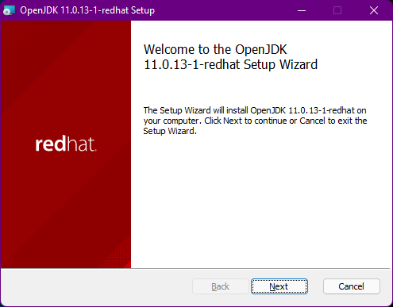
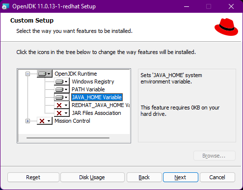
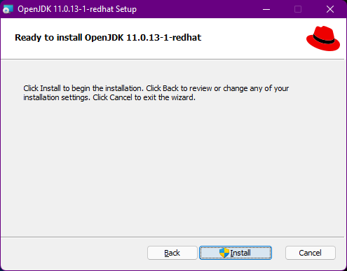
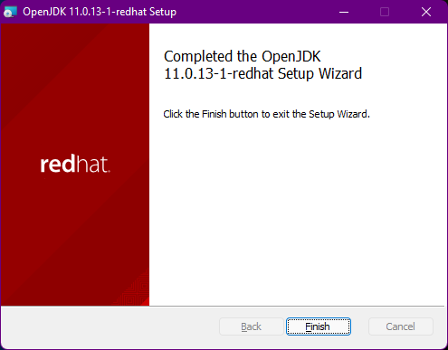

### Installing Red Hat OpenJDK 1.11 on Windows

> **_NOTE:_** Administrator privileges are required to perform the installation

- Navigate to [Red Hat Developer - OpenJDK Download](https://developers.redhat.com/products/openjdk/download)
- Find the most recent build of the **jdk-11.XXX.XXX-x64 MSI** where **XXX.XXX** is the most recent build and select the **Download** link
- Locate the directory to which the **MSI Installer** file was downloaded and execute the file

> **_NOTE:_** Windows may display a confirmation dialog confirming execution of a file that may contain malicious code.
> 
> - Select ***OK*** to continue.

- Select the ***Next*** button on the installer welcome screen to continue.

- Accept the license agreement by placing a tick in the ***I accept the terms in the License Agreement*** box.
- Select the ***Next*** button on the installer license agreement screen to continue.

- The **Custom Setup** window allows for customization of the JDK installation. The defaults should be sufficient.
- Select the ***Next*** button on the installer custom setup screen to continue.

- Select the ***Install*** button on the installer confirmation screen to install the OpenJDK.

- Once the installation has completed successfully click the  ***Finish*** button to complete the installation.